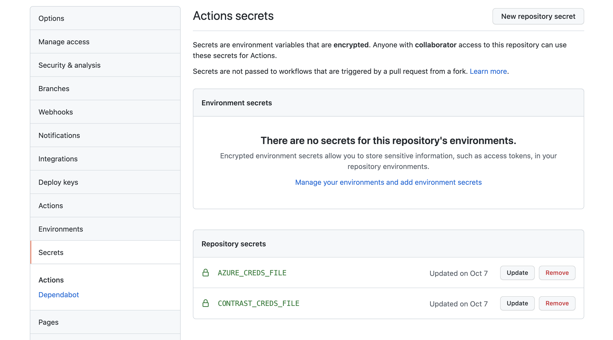

This article covers an ultra-quick way to get started with incorporating security into your existing developer onboarding via GitHub Actions, Contrast Security and Azure AKS.

GitHub Actions are everywhere. Whether you’re a part of an organization looking to scale workflows across the entire breadth of your business or a developer looking to get a leg up by incorporating new technologies and best practices into your automation stack, GitHub Actions and the GitHub Marketplace have you covered.

## Pre-Requisites

This step-by-step guide assumes you will be instrumenting Contrast Security with a containerized Java application that will be deployed to an Azure Kubernetes Service (AKS) PaaS Environment.

In order to work with the Contrast Security AKS GitHub Action, you will need the following in place:

 * An AKS cluster
 * A GitHub account
 * Contrast Security License
 * Contrast Security API Connection Details
 * Azure Service Details

Further details can be found in the Documentation section of this article.

## Steps

Let’s get started by creating two repository secrets for our Contrast Security and Azure credentials named `CONRAST_CREDS_FILE` and `AZURE_CREDS_FILE` respectively.

_Note - The repository secrets will need to be in JSON format._

The contents of the CONTRAST_CREDS_FILE contain details necessary for the Contrast Agent to communicate with the central Contrast Security Team Server:

 * contrast_api_url
 * contrast_api_username
 * contrast_api_api_key
 * contrast_api_service_key
 * contrast_agent_java_standalone_app_name
 * contrast_application_version

The AZURE_CREDS_FILE repository secret contains the following Azure resource details necessary to interact with the AKS Service:

 * azure_application_id
 * azure_tenant_id
 * azure_client_secret
 * Azure_subscription_id - the subscription used for the AKS Service
 * Azure_resource_group_name - resource group the cluster is under
 * Azure_region - region where the cluster is deployed
 * Azure_container_registry - URL used for the container registry



Next, we will paste the following workflow YAML and create a new file in the location `.github/workflows/main.yml`. This YAML is a basic workflow that will pull the specified github repository code locally onto the GitHub Action Runner. Once the code is pulled locally, the Contrast Security AKS GitHub Action will build and deploy a containerized PetClinic Java application with a Contrast Security Agent baked inside. The [sample repository](https://github.com/admiralappsec/eks-github-actions-demo) can be cloned or browsed, and the location of the workflow YAML is under the workflow directory.

```yaml
name: Build and Deploy Java app to Azure Kubernetes Service

on:
  push:
    branches:
      - main

env:
  IMAGE_NAME_TAG: 'aks-petclinic-testing:contrast-demo-4'
  APPLICATION_MANIFEST: '/example/kubernetes/petclinic.yaml'
  APPLICATION_DOCKERFILE: '/example/docker/Dockerfile'
  CLUSTER_NAME: 'aks-testing-ga'
  APPLICATION_ARTIFACT: '/example/docker/spring-petclinic-1.5.1.jar'

jobs:
  build-and-deploy:
    name: Build and Deploy
    runs-on: ubuntu-latest
    steps:
    - name: Checkout
      uses: actions/checkout@v2
    - name: Contrast Security Azure Kubernetes Service Build-Deploy
      uses: admiralappsec/aks-github-action@main
      id: contrast-build-deploy
      with:
        application-manifest: ${{ env.APPLICATION_MANIFEST }}
        application-dockerfile: ${{ env.APPLICATION_DOCKERFILE }}
        application-output-image-name-tag: ${{ env.IMAGE_NAME_TAG }}
        cluster-name: ${{ env.CLUSTER_NAME }}
        contrast-security-credentials-file: ${{ secrets.CONTRAST_CREDS_FILE }}
        azure-credentials-file: ${{ secrets.AZURE_CREDS_FILE }}
        application-artifact: ${{ env.APPLICATION_ARTIFACT }}
```

The workflow file above will trigger on all commits to the main branch. Looking at the inputs associated with the GitHub Action, you’ll need to make sure the following are passed:

 * Application-manifest - location of the kubernetes manifest
 * Application-dockerfile - location of the dockerfile
 * Application-output-image-name-tag - name of the resulting container image with Contrast baked inside
 * Cluster-name - name of the AKS cluster
 * Contrast-security-credentials-file - location of the Contrast Security credentials file
 * Azure-credentials-file - location of the Azure credentials file
 * Application-artifact - artifacts associated with the docker build (dockerfile needs)

Commit this file and go to the ‘Actions’ tab and watch the action work!

_Note - the GitHub Actions setting must be set to ‘allow’ on the repository itself, and this can be found under the ‘Settings’ tab._

The action should complete within 2-3 minutes. When completed, open the job and towards the end of the STDOUT, you will see links to your deployed service. Click the link.


You should see the application up and running.


Navigate to the Contrast Security UI and you will see the application’s security posture start to populate the screen.


## Documentation:

Example Contrast Security Credential File:

```yaml
{
    "contrast_api_url":"xxx",
    "contrast_api_username": "xxx",
    "contrast_api_api_key": "xxx",
    "contrast_api_service_key": "xxx",
    "contrast_agent_java_standalone_app_name": "xxx",
    "contrast_application_version": "xxx"
}
```

Example Azure Credentials File:

```yaml
{
    "azure_application_id": "xxx",
    "azure_tenant_id": "xxx",
    "azure_client_secret": "xxx",
    "azure_subscription_id": "xxx",
    "azure_resource_group_name": "xxx",
    "azure_region": "xxx",
    "azure_container_registry": "xxx"
}
```

_Note - The Service Principal will need enough permissions to build, commit, pull, and deploy a container image to AKS Documentation can be found at these locations:_

 * [Marketplace](https://github.com/marketplace/actions/contrast-security-eks-build-deploy)
 * [Action Repository](https://github.com/Contrast-Security-OSS/integration-eks-github-action)
 * [Example Code Repository](https://github.com/admiralappsec/eks-github-actions-demo)
 * [Contrast Security Website](https://contrastsecurity.com/)
 * [Contrast Security Docs](https://docs.contrastsecurity.com/?lang=en)
 * [Contrast Security Developer Hub](https://developer.contrastsecurity.com/)